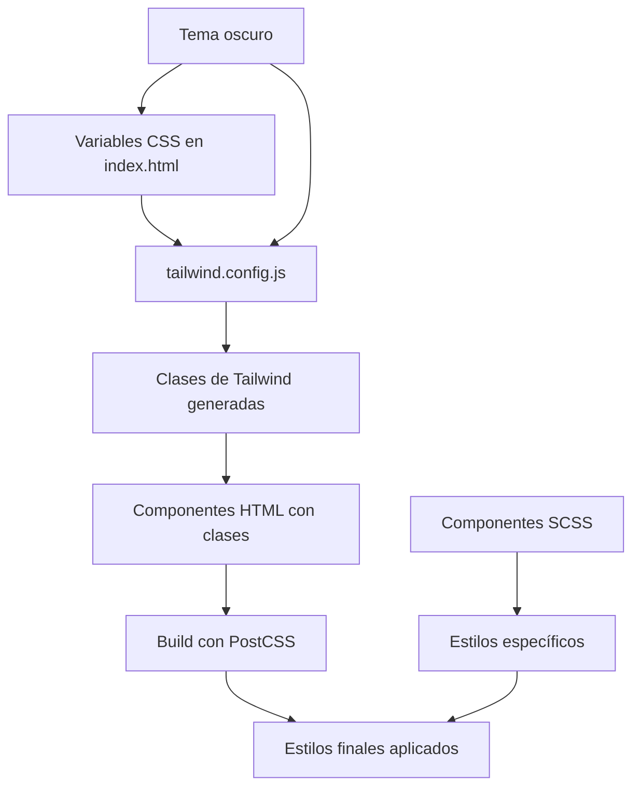

### Legacy Style Guide - Tailwind CSS System

**Note:** This document describes the legacy Tailwind CSS-based styling system. For the new SCSS architecture, please refer to the main [STYLE-GUIDE.md](../STYLE-GUIDE.md) in the project root.

Basado en el análisis del proyecto, tienes un sistema de diseño sólido con Tailwind CSS personalizado, pero hay inconsistencias en la aplicación de estilos. A continuación, te doy una guía completa para futuros desarrollos y para homogenizar el proyecto existente. El objetivo es mantener consistencia visual, mejorar mantenibilidad y evitar problemas como el que experimentaste al quitar el CDN.

#### 1. **Entender el Sistema de Diseño Actual**
Tu proyecto usa:
- **Tailwind CSS local** con configuración personalizada (`tailwind.config.js`)
- **Variables CSS** definidas en `index.html` para colores, bordes, etc.
- **Tema claro/oscuro** soportado con clases `dark:`
- **Componentes Angular** con estilos inline usando clases de Tailwind

**Diagrama del Sistema de Estilos:**


#### 2. **Principios para Futuros Desarrollos**
Sigue estos principios para mantener consistencia:

##### **a. Usar Siempre el Sistema de Colores Definido**
- **No uses colores hardcoded** (ej: `#ffffff` o `red`). Siempre usa las variables CSS mapeadas en Tailwind.
- Colores disponibles:
  - `bg-background` / `text-foreground`
  - `bg-primary` / `text-primary-foreground`
  - `bg-secondary` / `text-secondary-foreground`
  - `bg-muted` / `text-muted-foreground`
  - `bg-accent` / `text-accent-foreground`
  - `bg-card` / `text-card-foreground`
  - `border-border`
  - `ring-ring`

##### **b. Patrón Consistente para Formularios**
Todos los inputs deben seguir este patrón:
```html
<input class="w-full px-3 py-2 bg-background border border-border rounded-md text-sm focus:ring-2 focus:ring-primary/20 focus:border-primary">
```
- `bg-background`: Fondo consistente
- `border-border`: Bordes uniformes
- `rounded-md`: Radio de borde estándar
- `focus:ring-*`: Estados de foco consistentes

##### **c. Espaciado y Layout**
- Usa clases de Tailwind para espaciado: `p-4`, `m-2`, `gap-4`
- Para layouts: `flex`, `grid`, `container mx-auto`
- Mantén consistencia en padding/margin: usa múltiplos de 4px (ej: `p-2`, `p-4`, `p-6`)

##### **d. Componentes Reutilizables**
- Crea componentes base para elementos comunes:
  - Botones: `<button class="px-4 py-2 bg-primary text-primary-foreground rounded-md hover:bg-primary/90">`
  - Cards: `<div class="bg-card border border-border rounded-lg p-4">`
  - Inputs: Como arriba

##### **e. Tema Oscuro**
- Siempre incluye variantes `dark:` cuando sea necesario
- Las variables CSS ya manejan el tema, pero verifica que las clases apliquen correctamente

#### 3. **Guía para Homogenizar el Proyecto Existente**
Para estandarizar todo lo que ya tienes:

##### **a. Auditoría de Estilos**
1. **Revisa todos los componentes HTML**:
   - Busca clases hardcoded o inconsistentes
   - Reemplaza colores directos por variables (ej: `bg-white` → `bg-background`)
   - Asegura que todos los inputs usen el patrón estándar

2. **Archivos SCSS**:
   - Algunos componentes usan `.scss` (ej: `queue-management.component.scss`)
   - Migra estilos custom a clases de Tailwind cuando sea posible
   - Si necesitas estilos complejos, usa ` @apply` en Tailwind

##### **b. Estandarización Paso a Paso**
1. **Crear un archivo de constantes** (`src/styles/_constants.scss`):
   ```scss
   // Colores principales
   $primary: var(--primary);
   $background: var(--background);
   
   // Clases comunes
   .input-base {
     @apply w-full px-3 py-2 bg-background border border-border rounded-md text-sm focus:ring-2 focus:ring-primary/20 focus:border-primary;
   }
   
   .btn-primary {
     @apply px-4 py-2 bg-primary text-primary-foreground rounded-md hover:bg-primary/90 transition-colors;
   }
   ```

2. **Actualizar componentes**:
   - Reemplaza estilos repetitivos con las clases base
   - Ejemplo: Cambia `<input class="custom-input">` por `<input class="input-base">`

3. **Validar el build**:
   - Asegura que `ng build` y `ng serve` procesen Tailwind correctamente
   - Verifica que no haya clases no generadas (Tailwind purga clases no usadas)

##### **c. Herramientas de Ayuda**
- **Tailwind IntelliSense** en VS Code para autocompletado
- **PostCSS** ya configurado en `postcss.config.cjs`
- Ejecuta `npm run build:analyze` para ver el bundle y optimizar

#### 4. **Mejores Prácticas para el Equipo**
- **Documentación**: Crea un archivo `STYLE_GUIDE.md` con ejemplos
- **Code Reviews**: Revisa que nuevos componentes sigan los patrones
- **Component Library**: Considera crear una librería de componentes compartidos
- **Testing**: Asegura que estilos no rompan funcionalidad (usa Cypress para UI tests)

#### 5. **Migration to SCSS Architecture**

**Important:** The project is transitioning from Tailwind CSS to a custom SCSS architecture. For new components and styling:

1. **Use the SCSS system** documented in the main [STYLE-GUIDE.md](../STYLE-GUIDE.md)
2. **Follow BEM methodology** for class naming
3. **Leverage SCSS mixins and variables** instead of Tailwind utilities
4. **Create component-specific SCSS files** in `src/styles/components/`

#### 6. **Legacy Tailwind Solution**
For existing Tailwind-based components, to fix styling issues after CDN removal:
1. Verifica instalación: `npm install`
2. Build completo: `ng build --configuration=development`
3. Si no funciona, revisa logs de build para errores de Tailwind
4. Asegura que `src/styles.css` importe Tailwind: ` @tailwind base; @tailwind components; @tailwind utilities;`

**Note:** New development should prioritize the SCSS architecture over Tailwind utilities for better maintainability and consistency.
