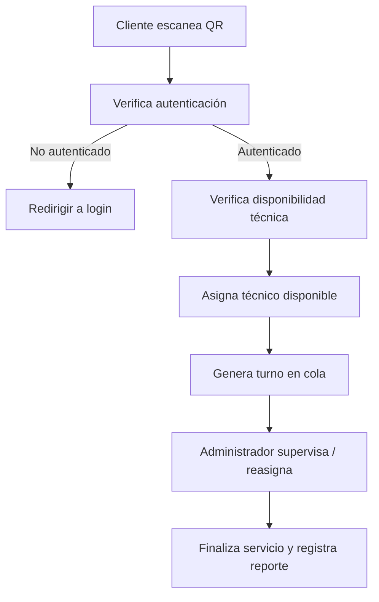

# 🔄 Flujo Cliente–Técnico–Administrador (Queue Flow)

## 📘 Objetivo
Estandarizar el flujo de atención en tiempo real: cliente → técnico → administrador.

---

## 🧭 Diagrama Lógico

---

## 🧩 Servicios Involucrados

* `client-flow.service.ts`
* `queue.service.ts`
* `queue-session.service.ts`
* `appointment.service.ts`
* `workshop-capacity.service.ts`
* `technician-metrics.service.ts`

---

## ✅ Checklist de Implementación

* [ ] Sincronizar cola en tiempo real (Firestore o WebSocket).
* [ ] Verificar límite de técnicos simultáneos.
* [ ] Agregar control de prioridades en `queue-session.service.ts`.
* [ ] Validar interfaz visual en componentes actuales (sin nuevos estilos).
* [ ] Loguear todos los eventos en `audit.service.ts`.

---

📍 *Última actualización:* *(pendiente de validación de flujo operativo)*